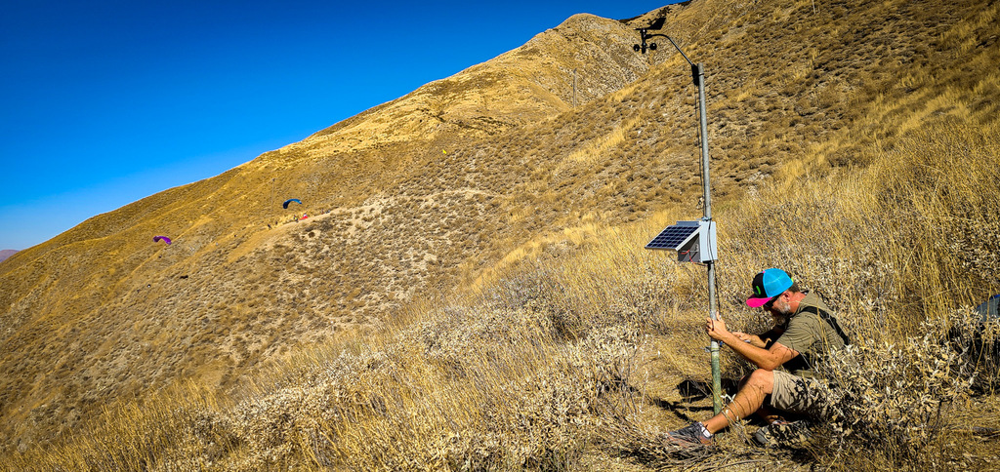

# RHC - Weather Station
An open source self contained weather station for remote applications where wifi and power are not available.

### Overview

The weather station is based around the Particle Cloud platform and the latest design uses the Particle.IO Boron LTE CAT-M1 development board for processing and connectivity. 
Additionaly a small arduino pro-mini is used as a watchdog to monitor system state and induce a restart if the the system is hung. This forces the Particle to reconnect and check in.

Wind observation are taken using a Davis Vantage Pro 6410 anemometer. Temperature, pressure, and humidify can be observed with a BPM280 or BME280 sensor.

Listener software running on a base unit (internet connected Particle Argon) or server application (nodejs) will monitor observations published to particle cloud from the weather station and post the parsed data to Weather Underground and Weather Flow. In the case of the server application we log obervations to a database that serves can be used to generate your own weather graphs without 3rd part services.

- [Recommended BOM](bom.md) 
- [Assembly instructions](assembly.md)
- [Particle-Listener](https://github.com/GravityDeficient/particle-listener) Reciever applictaion written in NodeJS
- [To-Do](TODO.md)